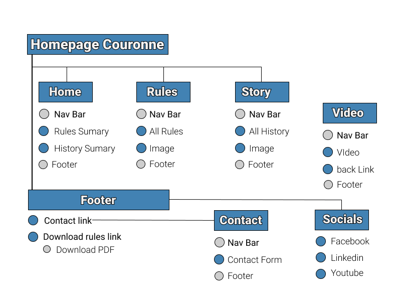

# Couronne, The Classic Bord Game

## Milestone project 1 (Code Institute)

This is a website that explains and tells the rules and story of a classic board game called couronne.
If you want to improve this board game that is available in all schools in Sweden, this is the place to be!

## Table of contents

1. [Introduction](#introduction)
2. [UX](#ux)
   1. [Ideal User Demographic](#Ideal-User-Demographic)
   2. [User Stories](#User-Stories)
   3. [Development Planes](#Development-Planes)
   4. [Design](#Design)
3. [Features](#Features)
   1. [Design Features](#[Design-Features)
   2. [Existing Features](#Existing-Features)
   3. [Features to Implement in the future](#Features-to-Implement-in-the-future)
4. [Issues and Bugs](#Issues-and-Bugs)
5. [Technologies Used](#Technologies-Used)
   1. [Main Languages Used](#Main-Languages-Used)
   2. [Additional Languages Used](#Additional-Languages-Used)
   3. [Frameworks, Libraries & Programs Used](#Frameworks,-Libraries-&-Programs-Used)
6. [Testing](#Testing)
7. [Deployment](#Deployment)
   1. [Deploying on GitHub Pages](#Deploying-on-GitHub-Pages)
   2. [Forking the Repository](#Forking-the-Repository)
   3. [Creating a Clone](#Creating-a-Clone)
8. [Credits](#Credits)
   1. [Content](#Content)
   2. [Media](#Media)
   3. [Code](#Code)
9. [Acknowledgements](#Acknowledgements)

# Introduction

This little site was designed mainly for nerds who already like the board game couronne.
Since the site is simple and minimal, I also hope to attract people who like board games in general

The focus of the website is to create an easy way to access the rules of the classic board game couronne. The story behind the game is also on this page as customer surveys have shown that it is interesting.

- The simplicity and small scale of the website is an important aspect to achieve an interest in bookmarking the page for return. Above all, rules are something you want to have easily accessible.
- As a former pool player, I know that easy access is crucial. It was not uncommon for the website for rules and history to be visited during ongoing matches and pool tournaments.

This is the first of four Milestone projects that the developer must complete during his Full Stack web development program at The Code Institute.

The most important requirements were to create a responsive and static website with at least three pages, mainly [**HTML5**](https://en.wikipedia.org/wiki/HTML5) and [**CSS3**](https://en.wikipedia.org/wiki/CSS).

[Back to the top](#table-of-contents)

# UX

## Ideal User Demographic

### The ideal user of this website is

- People who already like couronne
- People who want to learn couronne
- Users who like board games

- #### Potential Users Interviews

  - Two of them i asked (who are billiards players and like couronne) said directly and without a doubt that you want to be able to get the rules quick and easily.

  - Some people I interviewed wanted to know more about the origins and history behind the game.

  - Some people I asked said that the game's parts such as game rings and queues, size of the game surface were important to be able to find out.

## User Stories

### New/Potential Fans Goals:

1. As a new user, I want to easily navigate through the website to find the relevant content, effortlessly.

2. As a new user, I want to learn more about the classic bord game Couronne and the background in order to better understand the charm of the game..

3. As a new user, I want to easily find links to rules and history of the game.

4. As a new user, I want to easily navigate to Couronne's social links to keep track of the latest news and changes.

### Current Fans Goals:

1. As a current user, I want to navigate to information about rules and history, as well as social links.Thats it!

## Development Planes

| **_[Stategy](#Strategy)_** | **_[Scope](#Scope)_** | **_[Structure](#Structure)_** | **_[Skeleton](#Skeleton)_** | **_[Surface](#Surface)_** |
| -------------------------- | --------------------- | ----------------------------- | --------------------------- | ------------------------- |

### Strategy

With these goals in mind, a strategy table was created to determine the trade-off between importance and viability with the following results:

**_[Link to Stredegy Trade-off as PDF](assets/strategy-trade-off.pdf)_**


### Scope

- The site is for board game geeks who want to improve in that genre.

- Users who find this website are most certainly one who is looking for just and precisely rules and history for the board game couronne.

#### A scope was defined into two categories:

- ##### Content Requirements

  - The user will be looking for:
    - Rules of the game
    - History Information
    - Contact details
    - Social Links

- ##### Functionality Requirements
  - The user will be able to:
    - Easily navigate through the site in order to find the information they want.
    - Be able to find links to external sites in order to:
      - Find out more about board games and its comunity to meet others with similar interests.
    - Contact the site via contact page and social media links.

### Structure

The information architecture was organized in a hierarchial tree structure in order to ensure that users could navigate through the site with ease and efficiency, with the following results:


### Skeleton

Wireframe mockups were created in a Figma Workspace with providing a positive user experience in mind:

**_[Link to Figma Wireframes as PDF](assets/couronne-new.pdf)_**


[Back to the top](#table-of-contents)

### Surface

[Here comes the Markup](http://ami.responsivedesign.is/)

## Design

### Color Scheme

The main colours used throughout the website are a mixture of Blue, Some brown and White with gray/blue accents.

The chosen color scheme is a reflection of the nerdy little group expected to use this site.

### Typography

The pairing of the fonts Open Sans and Exo 2 is used throughout the website with Sans Serif as the fallback font in case of import failure.

### Picture

The background image is a blurred image to get some color on the page.

The selected image on the home page is modern and simple, reflecting the look and feel of the page and the game.
The image is captivating and visually represents the site's theme.

The pictures on the rules and story pages are some pictures I found online that have a Creative Commons license

- The images provides alternative text to use if the element cannot be reproduced.

  [Back to the top](#table-of-contents)

# Features

### Design Features

Each page of the website features a consistent responsive navigational system:

-At the top of all pages there is a navigation bar that is fixed for easy navigation on the site.

- On larger screens, the header contains some advertising text that disappears on mobile devices. The footer contains appropriate social media icons that link users to Couronne's main pages. For mobile devices, the header and footer are slightly modified.

#### Home Page, Rules Page and the History Page

- The Home, Rule and History Page is divided into two columns on desktops and one column on mobile devices.
  On mobile devices, all content is stacked in a column.
  The Rules Page and the History Page have an back button for easy navigation to the page you visit last.

#### Contact Page

- [ ] The contact page is unchanged regardless of the size of devices used. In addition to the header (see above).

- [ ] Contact Form - The form is not validated.
  - Depending on the time, maybe I just make the contact link only to ba a meil to link ....

### Existing Features

#### Header Logo

#### Header Navigation Bar

- Appearing on every page for a consistently easy and intuitive navigable system.

#### Social Icons

- Social Icons - The icons appear on each page and are appropriate representations of the social media platforms.

## Features to Implement in the future

- [ ] Make the contact page a separate page where you can write a message directly on the site and not just an email to link

- ### Merchandise Shop

- #### Feature
  - set up an shop where the Couronne can sell their merchandise directly to couronne players online.
  - #### Reason for not featuring in this release
    - JavaScript and/or Python needed to implemented.

[Back to the top](#table-of-contents)

# Issues and Bugs

- My mentor thought I should make my first suggestion a little more fansy, so I set up the navigation bar at the top to make the page a little more spacious.
  So now I have two variants of my page. And it has taken a lot of my time!

- Had difficulty getting my footer in place. Took help from google and found Dominic Fraser. [The fix page](https://www.freecodecamp.org/news/how-to-keep-your-footer-where-it-belongs-59c6aa05c59c/)

# Technologies Used

### Main Languages Used

- [HTML5](https://en.wikipedia.org/wiki/HTML5)

- [CSS3](https://en.wikipedia.org/wiki/CSS)

### Additional Languages Used

- [ ] [JavaScript](https://en.wikipedia.org/wiki/JavaScript)
  - Implement bla bla bla...

### Frameworks, Libraries & Programs Used

[Back to the top](#table-of-contents)

# Testing

[Testing information can be found in this separate testing file](testing.md)

# Deployment

- This project was developed using Visual Studio Code, committed to git and pushed to GitHub using the upload file-system on github.

## Deploying on GitHub Pages

To deploy this page to GitHub Pages from its GitHub repository, the following steps were taken:

1. Log into [GitHub or create an account](https://github.com/).
2. Locate the GitHub Repository.
3. At the top of the repository, select Settings from the menu items.
4. Scroll down the Settings page to the "GitHub Pages" section.
5. Under "Source" click the drop-down menu labelled "None" and select "Master Branch".
6. Upon selection, the page will automatically refresh meaning that the website is now deployed.
7. Scroll back down to the "GitHub Pages" section to retrieve the deployed link.
8. At the time of submitting this Milestone project the Development Branch and Master Branch are identical.

## Forking the Repository

By forking the GitHub Repository we make a copy of the original repository on our GitHub account to view and/or make changes without affecting the original repository by using the following steps...

1. Log into [GitHub or create an account](https://github.com/).
2. Locate the GitHub Repository.
3. At the top of the repository, on the right side of the page, select "Fork"
4. You should now have a copy of the original repository in your GitHub account.

## Creating a Clone

How to run this project locally:

1. Install the GitPod Browser Extension for Chrome.
2. After installation, restart the browser.
3. Log into [GitHub or create an account](https://github.com/).
4. Locate the GitHub Repository.
5. Click the green "GitPod" button in the top right corner of the repository. This will trigger a new gitPod workspace to be created from the code in github where you can work locally.

How to run this project within a local IDE, such as VSCode:

1. Log into GitHub or create an account.
2. Locate the GitHub Repository.
3. Under the repository name, click "Clone or download".
4. In the Clone with HTTPs section, copy the clone URL for the repository.
5. In your local IDE open the terminal.
6. Change the current working directory to the location where you want the cloned directory to be made.
7. Type 'git clone', and then paste the URL you copied in Step 3.

```
git clone https://github.com/USERNAME/REPOSITORY

```

8. Press Enter. Your local clone will be created.

Further reading and troubleshooting on cloning a repository from GitHub [**_here_**](https://docs.github.com/en/github/creating-cloning-and-archiving-repositories/cloning-a-repository)

[Back to the top](#table-of-contents)

# Credits

- I have used [Rebecca Tracey-Timoneys](https://github.com/rebeccatraceyt) README file [KryanLive](https://github.com/rebeccatraceyt/KryanLive/blob/master/README.md) as a guide / template for this README file.

- Thanks to Dominic Fraser who has a great explanation of how to put your footer in place. [The fix page](https://www.freecodecamp.org/news/how-to-keep-your-footer-where-it-belongs-59c6aa05c59c/)

## Content

-

## Media

- The image was sourced from nordiskagalleriet in Sweden (Creative Commons-licenses)
  - I have emailed and asked the owner (Klong) if I could use the image.

## Code

The developer consulted multiple sites in order to better understand the code they were trying to implement. For code that was copied and edited, the developer made sure to reference this with the code. The following sites were used on a more regular basis:

- [Stack Overflow](https://stackoverflow.com/)
- [W3Schools](https://www.w3schools.com/)
- [Bootstrap](https://getbootstrap.com/)
- [Css Tricks](https://css-tricks.com/)
- [COLORS](https://coolors.co/)

# Acknowledgements

[Back to the top](#table-of-contents)
