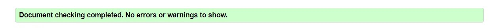
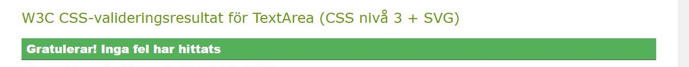
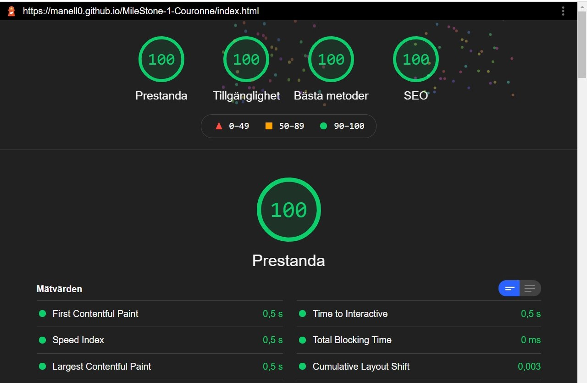

# Testing

[View website in GitHub Pages](https://manell0.github.io/MileStone-1-Couronne/index.html)

[GO TO README.md](README.md)

## Table of contents

1. [Testing User Stories](#Testing-User-Stories)
2. [Manual Testing](#Manual-Testing)
3. [Automated Testing](#Automated-Testing)
   1. [Code Validation](#Code-Validation)
   2. [Browser Validation](#HTML-Validation)
   3. [Lighthouse Auditing](#Lighthouse)
4. [User Testing](#User-Testing)

## Testing User Stories

### New/Potential Fans Goals:

1. As a new user, I want to easily navigate through the website to find the relevant content, effortlessly.

   - The navigation bars (Top nav bar and footer) is clearly defined and easily navigable for users to find and use.

   - The header on the top left of each page is explanatory and clear on all pages.

2. As a new user, I want to learn more about the classic board game couronne in order to better understand the rules and history.

   - The 'rules' and 'styry' pages is appropriately named for users wishing to find out about the game.
   - The 'rule' and 'story' pages is easily found on each page, no matter the device.

3. As a new user, I want to easily navigate to the artist's social links in order to keep up with the latest news.

   - The social links are located in the footer on desktop and tablet devices.
   - In each instance, each link is represented by an appropriate icon for easy identification of the social platform.

4. As a new user, I want to be able to watch an embedded video to be able to get a snapshot of the game .

## Manual Testing

### Elements / Items Testing

- All links leads to the right place and no broken links
- All icons, headers and text is on the right place regardless of screen size
- Download the rules on PDF
- Hover effects on all links
- Active link effects on all pages work
- The embedded video is muted on start

## Automated Testing

### code Validation

- The [W3C Markup Validator](https://validator.w3.org/) service was used to validate the HTML code used.

- The [W3C CSS Validator](https://jigsaw.w3.org/css-validator/) service was used to validate the CSS code used.

### HTML Validation

#### Results:

- All pages on the site have the same result. See below.

### CSS Validation

#### Results:

- It´s only one CSS file in the project (style.css)
  - (The test is done from Swedish browser, translated into English: Congratulations! No errors were found)

## Lighthouse

Screen shot from index page (desktop device)
[Lighthouse test as PDF ](assets/lighthouse.pdf)

## User Testing

Family members were asked to review the site and documentation to point out any bugs and/or user experience issues. Their helpful advice throughout the process led to many UX changes in order to create a better experience.

- Change to the Navbar text size on mobiles in order for the toggler menu icon to more distinguishable.

- Decided that footer should also (as top navigation bar) be fixed because it is much better for the UX.

[Back to the top](#Testing)
